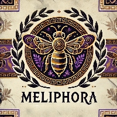

  
  <h1>🐝 Meliphora 🐝</h1>
  <h3>Your Comprehensive Beekeeping Management Platform</h3>
  
Track, manage, and optimize your apiaries, hives, and bee colonies with precision. Designed for beekeepers of all scales, Meliphora empowers you to make data-driven decisions for healthier bees and better harvests.

## 👋 Welcome to Meliphora!🐝

Meliphora is a beekeeping management platform designed to help beekeepers of all scales track, manage, and optimize their apiaries, hives, and bee colonies. 
Whether you're a hobbyist with a few backyard hives or a commercial beekeeper managing multiple apiaries, Meliphora provides the tools you need for better hive health, increased productivity, and streamlined operations.

Our mission is to provide a comprehensive, user-friendly, and data-driven solution for the beekeeping community.

## 🤔 Why Meliphora? 🐝

*   **Comprehensive Tracking:** From individual queen performance to apiary-level analytics, get a detailed view of your operation.
*   **Data-Driven Decisions:** Leverage detailed records and reports to make informed choices about hive management, treatments, and harvesting.
*   **Modern Tech Stack:** Built with Next.js, Supabase, and Drizzle ORM for a robust, scalable, and enjoyable developer experience.
*   **Open Source & Community Driven:** We believe in the power of community. Contribute, suggest features, and help shape the future of beekeeping technology.
*   **User-Focused Design:** Intuitive interface designed for ease of use in the field and at your desk.

## ✨ Core Platform Features 🐝

*   **Dashboard Overview**: Quick snapshot of your operation with key metrics and alerts.
*   **Apiary Management**: Track multiple apiary locations with details, mapping, and environmental data.
*   **Hive Tracking**: Monitor individual hives, their status, source, type, and history.
*   **Queen Management**: Detailed records for queen lineage, status, marking, performance, and replacement schedules.
*   **Inspection Records**: Log comprehensive hive inspections with customizable templates (queen status, brood pattern, stores, pests, diseases).
*   **Treatment & Feeding Tracking**: Schedule, record, and monitor pest/disease treatments, medications, and supplemental feeding.
*   **Harvest Logging**: Record honey, beeswax, and other product harvests with detailed attributes.
*   **Pest & Disease Monitoring**: Systematically record observations and levels of common pests and diseases.
*   **Task Management**: Schedule and manage beekeeping activities (inspections, feeding, harvest, maintenance).
*   **User & Organization Management**: Secure multi-tenancy support allowing users to manage their beekeeping operations within their own organization.
*   **Reporting & Analytics**: Gain insights into colony health, productivity, and financial performance.
*   **Responsive Design**: Access your data from any device, anywhere.

*(Additional features like advanced Weather Integration, Bloom Tracking, Scientific Testing, Community Features, and more are under development!)*

## 📊 Feature Status

| Feature                     | Status                 | Notes                                       |
| --------------------------- | ---------------------- | ------------------------------------------- |
| Dashboard Overview          | Implemented (v1)       | Core metrics displayed.                     |
| Apiary Management           | Implemented (v1)       | operations, basic details.                  |
| Hive Tracking               | Implemented (v1)       | status, linkage to apiary/queen.            |
| Queen Management            | Implemented (v1)       | lineage, marking, status.                   |
| Inspection Records          | Implemented (v1)       | Detailed logging, observations.             |
| Treatment Tracking          | Implemented (v1)       | Scheduling, logging, product details.       |
| Feeding Records             | Implemented (v1)       | Logging feed type, quantity, date.          |
| Harvest Logging             | Implemented (v1)       | Honey, wax, etc.                            |
| Pest & Disease Library      | Implemented (v1)       | System & custom entries.                    |
| Pest & Disease Sighting     | Implemented (v1)       | Linking to inspections.                     |
| Task Management             | Planned                |                                             |
| User & Org Management       | Implemented (Core)     |                                             |
| Authentication              | Implemented            | Supabase Auth (email/pass, OAuth planned).  |
| Subscription Management     | Implemented (Basic)    |                                             |
| Weather Integration         | Planned                |                                             |
| Bloom Tracking / Plants     | Implemented (Basic)    | Logging local flora and bloom periods.      |
| Reports                     | Implemented (Basic)    | Initial reports for key areas.              |
| Scientific Testing          | Implemented (Basic)    | Logging test methods and results.           |
| Responsive Design           | Implemented            | Core layouts adapt to screen sizes.         |
| Community / Clubs           | Planned                |                                             |

*(This table will be updated as the project evolves.)*

## 📜 Repository Content & Licensing

*   **Meliphora Platform:** The core Meliphora platform is a commercial product and is proprietary.
*   **This Repository:**
    *   May contain open-source tools, client libraries, or examples provided by Meliphora. Any such code will have a specific open-source license (e.g., MIT, Apache 2.0) clearly indicated in its respective directory or file.
    *   Houses documentation, facilitates issue tracking for its contents, and supports community discussions related to the Meliphora platform and its ecosystem.
    *   Unless otherwise specified for code components, content in this repository is provided for informational and community engagement purposes.

We welcome contributions from the community! Whether it's reporting a bug, suggesting a feature, improving documentation, or writing code, your help is appreciated.
ch of the `Meliphora/meliphora` repository. Provide a clear description of your changes.

## 💬 Community & Support

*   **(Future) Discord Server:** A place for community discussion, help, and announcements (Link to be added).
*   **(Future) Discussions Tab:** GitHub Discussions for broader topics and Q&A.

---

🐝 Thank you for your interest in Meliphora! We're excited to build a great tool for the beekeeping community together. 🐝

